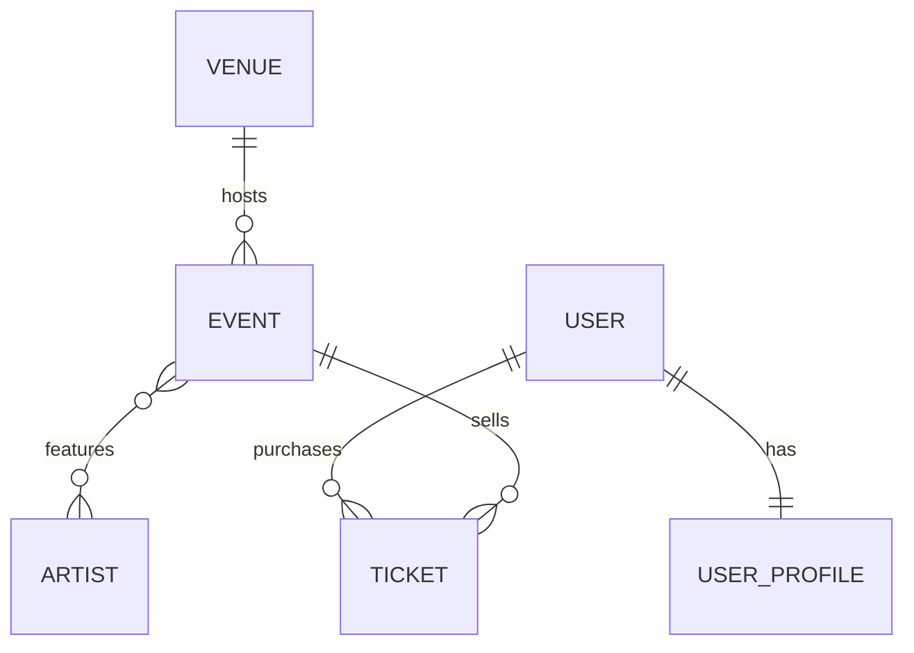

# PulsePass — Product Requirements Document

**Plataforma de eventos, artistas y entradas**  
*Caso de estudio académico para capa de persistencia*

| **Documento**            | PRD - PulsePass                                  |
|--------------------------|--------------------------------------------------|
| **Versión**              | 1.0                                              |
| **Estado**               | Aprobado para taller académico                   |
| **Tecnologías objetivo** | Java 21 / Spring Boot 4 / JPA / PostgreSQL       |
| **Alcance técnico**      | Persistencia, consultas y pruebas de integración |

Documento de requisitos del producto

# Control del documento

| Campo            | Detalle                                                                                                                                             |
|------------------|-----------------------------------------------------------------------------------------------------------------------------------------------------|
| Propósito        | Definir los requisitos funcionales, reglas de negocio y criterios de aceptación de PulsePass para servir como fuente de verdad del caso de estudio. |
| Audiencia        | Estudiantes, docentes y revisores técnicos del taller de persistencia.                                                                              |
| Alcance          | MVP académico enfocado en el dominio y la persistencia. No prescribe una solución completa de API o UI.                                             |
| Fuera de alcance | Autenticación, autorización, pasarela de pagos, notificaciones, frontend, reembolsos reales y operaciones administrativas avanzadas.                |

# 1. Resumen ejecutivo

PulsePass es una plataforma para descubrir eventos y administrar entradas de conciertos, festivales, conferencias, eventos universitarios, competencias deportivas y actividades culturales. El MVP académico debe permitir representar venues, eventos, artistas, usuarios, perfiles y tickets, preservando integridad referencial y soportando consultas frecuentes del negocio.

El caso de estudio fue diseñado para que los estudiantes transformen requisitos funcionales en un modelo relacional, migraciónes Flyway, entidades JPA, repositories Spring Data, consultas derivadas, JPQL y pruebas contra PostgreSQL real con Testcontainers.

> **Principio de producto**  
> PulsePass debe preservar información consistente incluso cuando varias entidades estén relacionadas. La base de datos es parte activa de la integridad del producto, no un simple almacenamiento pasivo.

# 2. Visión y problema

## 2.1 Problema

Los usuarios necesitan una forma consistente de conocer eventos, sus artistas participantes y la disponibilidad conceptual de entradas. Los organizadores necesitan que cada evento este asociado a un venue valido y que cada ticket mantenga trazabilidad hacia un usuario y un evento.

## 2.2 Visión

Construir un nucleo de datos confiable para PulsePass que permita evolucionar posteriormente hacia una API transaccional de venta de entradas sin rehacer el modelo fundamental.

## 2.3 Objetivos del MVP

- Registrar venues y eventos con identificadores de negocio únicos.

- Relacionar artistas con multiples eventos.

- Registrar usuarios y un perfil individual por usuario.

- Representar tickets como una entidad de dominio con precio, tipo, estado y fecha de compra.

- Consultar eventos y tickets mediante criterios frecuentes de negocio.

- Garantizar reglas clave mediante constraints en PostgreSQL.

- Validar el modelo y las consultas mediante pruebas de integración reproducibles.

## 2.4 No objetivos

- Procesar pagos reales.

- Generar codigos QR.

- Implementar control de acceso fisico al evento.

- Gestiónar devoluciones monetarias.

- Implementar login, roles o autorización.

- Construir una interfaz web o movil.

# 3. Actores y necesidades

| Actor                | Necesidad principal                                                                        |
|----------------------|--------------------------------------------------------------------------------------------|
| Asistente / usuario  | Descubrir eventos, mantener un perfil y poseer tickets asociados a su cuenta.              |
| Operacion de eventos | Mantener información consistente de venues, eventos, artistas y estados de publicacion.    |
| Analista / soporte   | Consultar tickets vendidos, eventos publicados y relaciones entre artistas y eventos.      |
| Equipo de desarrollo | Contar con un modelo persistente versionado, verificable y probado contra PostgreSQL real. |

# 4. Alcance funcional del MVP

El MVP se divide en seis capacidades funcionales. Cada requisito posee un identificador que debe utilizarse en commits, pruebas o documentacion cuando sea posible.

## 4.1 Gestión de venues

| ID         | Requisito                   | Descripción                                                                             | Prioridad | Criterio de aceptación                                                      |
|------------|-----------------------------|-----------------------------------------------------------------------------------------|-----------|-----------------------------------------------------------------------------|
| FR-VEN-001 | Registrar venue             | El sistema debe almacenar codigo, nombre, ciudad, direccion, capacidad y estado activo. | Must      | Un venue valido se persiste y puede recuperarse por su ID y codigo.         |
| FR-VEN-002 | Código único                | No pueden existir dos venues con el mismo codigo.                                       | Must      | El segundo registro con codigo duplicado es rechazado por la base de datos. |
| FR-VEN-003 | Capacidad valida            | La capacidad debe ser mayor que cero.                                                   | Must      | PostgreSQL rechaza capacidad igual o menor que cero.                        |
| FR-VEN-004 | Consultar eventos por venue | Debe ser posible recuperar eventos asociados a un venue usando su codigo de negocio.    | Should    | La consulta retorna solo eventos del venue solicitado.                      |

## 4.2 Gestión de eventos

| ID         | Requisito            | Descripción                                                                           | Prioridad | Criterio de aceptación                                                             |
|------------|----------------------|---------------------------------------------------------------------------------------|-----------|------------------------------------------------------------------------------------|
| FR-EVT-001 | Registrar evento     | Registrar codigo, nombre, descripcion, categoria, estado, fecha, edad minima y venue. | Must      | El evento queda asociado a un venue existente.                                     |
| FR-EVT-002 | Código único         | eventCode debe ser único.                                                             | Must      | PostgreSQL rechaza codigos duplicados.                                             |
| FR-EVT-003 | Estado controlado    | El estado debe pertenecer al catalogo definido.                                       | Must      | No se persisten estados fuera de DRAFT, PUBLISHED, SOLD_OUT, CANCELLED o FINISHED. |
| FR-EVT-004 | Categoria controlada | La categoria debe pertenecer al catalogo definido.                                    | Must      | La categoria se almacena como valor legible, no como ordinal inestable.            |
| FR-EVT-005 | Eventos publicados   | Consultar eventos PUBLISHED ordenados por fecha ascendente.                           | Must      | Solo se retornan eventos publicados y en orden cronológico.                        |
| FR-EVT-006 | Evento hibrido       | Un evento puede opcionalmente tener una URL de streaming de hasta 500 caracteres.     | Should    | La columna puede ser NULL y Flyway introduce el cambio en una migración posterior. |

## 4.3 Gestión de artistas

| ID         | Requisito              | Descripción                                               | Prioridad | Criterio de aceptación                                              |
|------------|------------------------|-----------------------------------------------------------|-----------|---------------------------------------------------------------------|
| FR-ART-001 | Registrar artista      | Registrar nombre artistico, pais, genero y estado activo. | Must      | El artista puede persistirse y recuperarse.                         |
| FR-ART-002 | Nombre artistico único | stageName no puede repetirse.                             | Must      | La BD rechaza duplicados.                                           |
| FR-ART-003 | Artistas por evento    | Un evento puede asociar multiples artistas.               | Must      | La asociacion se persiste sin duplicar el mismo par evento-artista. |
| FR-ART-004 | Eventos por artista    | Un artista puede participar en varios eventos.            | Must      | Una consulta JPQL recupera los eventos del artista solicitado.      |

## 4.4 Gestión de usuarios y perfiles

| ID         | Requisito         | Descripción                                                                  | Prioridad | Criterio de aceptación                                                      |
|------------|-------------------|------------------------------------------------------------------------------|-----------|-----------------------------------------------------------------------------|
| FR-USR-001 | Registrar usuario | Registrar username, email y estado activo.                                   | Must      | El usuario puede persistirse y recuperarse.                                 |
| FR-USR-002 | Identidad unica   | username y email deben ser únicos.                                           | Must      | Duplicados son rechazados por PostgreSQL.                                   |
| FR-USR-003 | Perfil individual | Cada usuario puede poseer un único UserProfile.                              | Must      | La FK del perfil es UNIQUE y no permite dos perfiles para el mismo usuario. |
| FR-USR-004 | Datos de perfil   | El perfil almacena nombre, apellido, telefono, ciudad y fecha de nacimiento. | Should    | Los datos se recuperan desde la relacion User 1:1 UserProfile.              |

## 4.5 Gestión de tickets

| ID         | Requisito                  | Descripción                                                           | Prioridad | Criterio de aceptación                              |
|------------|----------------------------|-----------------------------------------------------------------------|-----------|-----------------------------------------------------|
| FR-TKT-001 | Emitir ticket              | Cada ticket debe estar asociado a un usuario y a un evento.           | Must      | No puede existir un ticket sin ambas FK validas.    |
| FR-TKT-002 | Código único               | ticketCode debe ser único.                                            | Must      | PostgreSQL rechaza ticketCode duplicado.            |
| FR-TKT-003 | Precio no negativo         | El precio debe ser mayor o igual a cero.                              | Must      | CHECK impide valores negativos.                     |
| FR-TKT-004 | Tipo de ticket             | Soportar GENERAL, VIP, BACKSTAGE y STUDENT.                           | Must      | El tipo se persiste como valor estable.             |
| FR-TKT-005 | Estado de ticket           | Soportar RESERVED, PAID, CANCELLED y USED.                            | Must      | Solo se utilizan estados permitidos.                |
| FR-TKT-006 | Tickets por usuario        | Consultar tickets de un usuario por email y opcionalmente por estado. | Must      | Se navega Ticket -\> User -\> email.                |
| FR-TKT-007 | Tickets pagados por evento | Recuperar tickets PAID de un evento mediante eventCode.               | Must      | Solo retorna tickets pagados del evento solicitado. |
| FR-TKT-008 | Conteo de ventas           | Contar tickets PAID de un evento.                                     | Should    | La consulta retorna un valor numerico correcto.     |

## 4.6 Descubrimiento y consultas

| ID         | Requisito                    | Descripción                                                                                        | Prioridad | Criterio de aceptación                                                         |
|------------|------------------------------|----------------------------------------------------------------------------------------------------|-----------|--------------------------------------------------------------------------------|
| FR-SRC-001 | Buscar eventos por artista   | Buscar eventos donde participe un artista por stageName.                                           | Must      | La consulta usa la relacion N:M y no devuelve duplicados.                      |
| FR-SRC-002 | Eventos por ciudad y artista | Buscar eventos de una ciudad en los que participe un artista especifico.                           | Should    | Filtra por venue.city y artist.stageName.                                      |
| FR-SRC-003 | Eventos recomendados         | Buscar eventos publicados posteriores a una fecha, en una ciudad y cuyo artista contenga un texto. | Should    | La consulta es case-insensitive para artista, usa DISTINCT y ordena por fecha. |
| FR-SRC-004 | Tickets de eventos futuros   | Consultar tickets cuyo evento sea posterior a una fecha.                                           | Could     | Los resultados quedan ordenados cronologicamente.                              |

# 5. Reglas de negocio

| ID     | Regla                                                                                                                                                           |
|--------|-----------------------------------------------------------------------------------------------------------------------------------------------------------------|
| BR-001 | Todo Event debe pertenecer a exactamente un Venue.                                                                                                              |
| BR-002 | Un Venue puede albergar cero o muchos Event.                                                                                                                    |
| BR-003 | Un Event puede relacionarse con cero o muchos Artist y un Artist con cero o muchos Event.                                                                       |
| BR-004 | Un usuario puede tener como maximo un UserProfile.                                                                                                              |
| BR-005 | Un Ticket pertenece a exactamente un User y exactamente un Event.                                                                                               |
| BR-006 | Ticket es una entidad y no un @ManyToMany simple porque contiene datos propios: ticketCode, type, price, status y purchaseDate.                                 |
| BR-007 | Los precios se almacenan con precision decimal apropiada; no deben modelarse con float/double.                                                                  |
| BR-008 | Los enums persistentes deben almacenarse por nombre estable y no por ordinal.                                                                                   |
| BR-009 | Los identificadores de negocio (code, eventCode, ticketCode, username, email y stageName segun corresponda) deben protegerse mediante UNIQUE en PostgreSQL.     |
| BR-010 | La regla SOLD_OUT no se infiere automaticamente en este MVP; su calculo futuro podra comparar capacidad del venue contra tickets PAID segun politica comercial. |

# 6. Modelo de dominio

El siguiente modelo conceptual es obligatorio para el MVP:

> Venue 1 ---- N Event  
> Event N ---- M Artist  
> User 1 ---- 1 UserProfile  
> User 1 ---- N Ticket  
> Event 1 ---- N Ticket

## 6.1 Entidades y atributos minimos

| Entidad     | Atributos minimos                                                                              |
|-------------|------------------------------------------------------------------------------------------------|
| Venue       | id, code, name, city, address, capacity, active                                                |
| Event       | id, eventCode, name, description, category, status, eventDate, minimumAge, streamingUrl, venue |
| Artist      | id, stageName, country, genre, active                                                          |
| User        | id, username, email, active                                                                    |
| UserProfile | id, firstName, lastName, phone, city, birthDate, user                                          |
| Ticket      | id, ticketCode, type, price, status, purchaseDate, user, event                                 |

## 6.2 Enums

| Enum          | Valores                                                      |
|---------------|--------------------------------------------------------------|
| EventCategory | MUSIC, SPORTS, TECHNOLOGY, EDUCATION, CULTURE, ENTERTAINMENT |
| EventStatus   | DRAFT, PUBLISHED, SOLD_OUT, CANCELLED, FINISHED              |
| TicketType    | GENERAL, VIP, BACKSTAGE, STUDENT                             |
| TicketStatus  | RESERVED, PAID, CANCELLED, USED                              |

# 7. Esquema relacional esperado

El equipo debe implementar como minimo las tablas siguientes:

- venues

- events

- artists

- event_artists

- users

- user_profiles

- tickets

La tabla event_artists representa la relacion N:M y debe usar una clave primaria compuesta (event_id, artist_id) o una restriccion UNIQUE equivalente que impida repetir la misma asociacion.

# 8. Integridad de datos

| Campo / relacion    | Regla de integridad                        |
|---------------------|--------------------------------------------|
| Venue.code          | UNIQUE, NOT NULL                           |
| Venue.capacity      | CHECK capacity \> 0                        |
| Event.eventCode     | UNIQUE, NOT NULL                           |
| Artist.stageName    | UNIQUE, NOT NULL                           |
| User.username       | UNIQUE, NOT NULL                           |
| User.email          | UNIQUE, NOT NULL                           |
| UserProfile.user_id | FK + UNIQUE para garantizar 1:1            |
| Ticket.ticketCode   | UNIQUE, NOT NULL                           |
| Ticket.price        | CHECK price \>= 0                          |
| Ticket.user_id      | FK, NOT NULL                               |
| Ticket.event_id     | FK, NOT NULL                               |
| event_artists       | PK compuesta o UNIQUE(event_id, artist_id) |

# 9. Ciclos de estado

## 9.1 EventStatus

Secuencia conceptual recomendada:

> DRAFT -\> PUBLISHED -\> SOLD_OUT -\> FINISHED  
> \\\> CANCELLED

El MVP no exige implementar una maquina de estados en Java, pero las consultas y datos de prueba deben utilizar estados coherentes.

## 9.2 TicketStatus

> RESERVED -\> PAID -\> USED  
> \\\> CANCELLED

El MVP no procesa pagos; PAID representa un estado de negocio ya confirmado por un sistema externo futuro.

# 10. Casos de uso clave

| ID    | Caso de uso            | Resultado esperado                                                     |
|-------|------------------------|------------------------------------------------------------------------|
| UC-01 | Registrar venue        | Crear un venue valido y recuperarlo por codigo.                        |
| UC-02 | Publicar evento        | Registrar un evento asociado a un venue y marcarlo PUBLISHED.          |
| UC-03 | Asignar artistas       | Relacionar uno o mas artistas a un evento sin duplicar asociaciones.   |
| UC-04 | Crear usuario y perfil | Registrar un usuario y un único perfil asociado.                       |
| UC-05 | Emitir ticket          | Crear un ticket asociado a usuario y evento con tipo, precio y estado. |
| UC-06 | Consultar cartelera    | Listar eventos publicados ordenados por fecha.                         |
| UC-07 | Buscar por artista     | Listar eventos en los que participa un artista.                        |
| UC-08 | Consultar ventas       | Listar y contar tickets PAID de un evento.                             |
| UC-09 | Descubrir eventos      | Filtrar eventos por ciudad, fecha y artista.                           |

# 11. Criterios de aceptación funcionales

| ID     | Escenario de aceptación                                                                                                                            |
|--------|----------------------------------------------------------------------------------------------------------------------------------------------------|
| AC-001 | Dado un venue con codigo VEN-SMR-01, cuando se persiste correctamente, entonces puede recuperarse por codigo y su capacidad es mayor que cero.     |
| AC-002 | Dado un evento CMF-2026 asociado a VEN-SMR-01, cuando se consulta por eventCode, entonces se recupera el evento y su venue.                        |
| AC-003 | Dado un evento con tres artistas, cuando se persiste la asociacion, entonces los tres aparecen relacionados y no se duplica un par evento-artista. |
| AC-004 | Dado un usuario con un perfil, cuando se intenta asociar un segundo perfil al mismo usuario, entonces la base de datos impide la violacion 1:1.    |
| AC-005 | Dado un ticket TCK-0001, cuando se intenta crear otro con el mismo codigo, entonces PostgreSQL rechaza el segundo registro.                        |
| AC-006 | Dados eventos en diferentes estados, cuando se consultan los PUBLISHED, entonces no aparecen DRAFT ni CANCELLED.                                   |
| AC-007 | Dados varios eventos con Solar Beat, cuando se busca por artista, entonces todos los eventos relacionados aparecen una sola vez.                   |
| AC-008 | Dados tickets PAID, RESERVED y CANCELLED, cuando se cuentan ventas de un evento, entonces solo los PAID participan del conteo.                     |

# 12. Requisitos no funcionales

| ID      | Requisito no funcional                                                                                                                  |
|---------|-----------------------------------------------------------------------------------------------------------------------------------------|
| NFR-001 | Integridad: Las reglas criticas de unicidad, referencias y rangos deben reforzarse en PostgreSQL.                                       |
| NFR-002 | Trazabilidad de esquema: Todo cambio estructural debe versionarse con Flyway.                                                           |
| NFR-003 | Reproducibilidad: Una base vacia debe poder reconstruirse ejecutando todas las migraciónes en orden.                                    |
| NFR-004 | Portabilidad de pruebas: Las pruebas no pueden depender de una instancia PostgreSQL instalada manualmente en la maquina del estudiante. |
| NFR-005 | Realismo de pruebas: Las pruebas de integración deben usar PostgreSQL mediante Testcontainers, no H2.                                   |
| NFR-006 | Legibilidad: Los nombres de entidades, atributos y repositories deben reflejar el lenguaje del dominio.                                 |
| NFR-007 | Mantenibilidad: Las consultas simples deben preferir Query Methods; las consultas complejas deben usar JPQL legible.                    |
| NFR-008 | Precisión monetaria: Los valores monetarios deben utilizar BigDecimal/NUMERIC con precision definida.                                   |

# 13. Restricciones tecnicas del caso academico

- Java 21.

- Spring Boot 4.x.

- Maven como sistema de build.

- Spring Data JPA / Hibernate para persistencia ORM.

- PostgreSQL como motor de base de datos.

- Flyway como único responsable de crear/evolucionar el esquema.

- spring.jpa.hibernate.ddl-auto=validate.

- Testcontainers para PostgreSQL en pruebas de integración.

- No utilizar H2.

- No utilizar SQL nativo para los requisitos de consulta del taller.

- No utilizar Lombok @Data sobre entidades.

# 14. Estrategia de consultas esperada

| Necesidad                                     | Mecanismo esperado / recomendado            |
|-----------------------------------------------|---------------------------------------------|
| Buscar entidad por ID                         | Metodo heredado de JpaRepository            |
| Buscar evento por eventCode                   | Query Method                                |
| Buscar usuario por email ignorando mayúsculas | Query Method                                |
| Eventos publicados ordenados por fecha        | Query Method                                |
| Eventos de un venue por venue.code            | Query Method navegando relacion             |
| Tickets de un usuario por email y status      | Query Method navegando relacion             |
| Eventos por artista                           | @Query + JPQL con JOIN                      |
| Tickets PAID por eventCode                    | Query Method o JPQL, justificando eleccion  |
| Conteo de tickets PAID                        | @Query + JPQL con COUNT                     |
| Eventos por ciudad + artista                  | @Query + JPQL con multiples asociaciones    |
| Eventos recomendados                          | @Query + JPQL con filtros, DISTINCT y orden |

# 15. Migraciones requeridas

| Migracion                            | Objetivo                                                                                                                     |
|--------------------------------------|------------------------------------------------------------------------------------------------------------------------------|
| V1\_\_create_schema.sql              | Crea venues, events, artists, event_artists, users, user_profiles y tickets con PK, FK, UNIQUE, CHECK e indices pertinentes. |
| V2\_\_insert_initial_artists.sql     | Inserta el catalogo inicial de artistas de prueba: Solar Beat, Neon Waves, Caribbean Sound, Ocean Drive y Digital Pulse.     |
| V3\_\_add_streaming_url_to_event.sql | Agrega streaming_url VARCHAR(500) nullable a events sin modificar V1.                                                        |

# 16. Datos de referencia del escenario

## 16.1 Venue

| code     | VEN-SMR-01               |
|----------|--------------------------|
| name     | Marina Convention Center |
| city     | Santa Marta              |
| capacity | 5000                     |

## 16.2 Evento principal

| eventCode | CMF-2026                                |
|-----------|-----------------------------------------|
| name      | Caribbean Music Fest 2026               |
| category  | MUSIC                                   |
| status    | PUBLISHED                               |
| artists   | Solar Beat, Neon Waves, Caribbean Sound |

## 16.3 Tickets de ejemplo

| Usuario | Tipo    | Estado    | Precio |
|---------|---------|-----------|--------|
| Andrea  | VIP     | PAID      | 250000 |
| Carlos  | GENERAL | PAID      | 120000 |
| Laura   | GENERAL | RESERVED  | 120000 |
| Miguel  | VIP     | CANCELLED | 250000 |

# 17. Estrategia de pruebas y calidad

La implementacion se considera aceptable solo si las pruebas demuestran comportamiento funcional e integridad de datos. Las pruebas deben iniciar PostgreSQL mediante Testcontainers, permitir que Flyway construya el esquema y despues ejecutar repositories y consultas.

| ID     | Criterio de calidad                                              |
|--------|------------------------------------------------------------------|
| QT-001 | Flyway aplica V1, V2 y V3 desde una base vacia.                  |
| QT-002 | Hibernate valida el esquema sin crearlo ni actualizarlo.         |
| QT-003 | Se prueba la relacion Venue 1:N Event.                           |
| QT-004 | Se prueba User 1:1 UserProfile.                                  |
| QT-005 | Se prueba Event N:M Artist.                                      |
| QT-006 | Se prueban Ticket -\> User y Ticket -\> Event.                   |
| QT-007 | Se prueban Query Methods simples y con navegacion de relaciones. |
| QT-008 | Se prueban consultas JPQL con JOIN y COUNT.                      |
| QT-009 | Se prueba al menos una restriccion UNIQUE usando saveAndFlush.   |
| QT-010 | mvn clean test finaliza con BUILD SUCCESS.                       |

# 18. Fuera de alcance del taller

- Calculo real de disponibilidad de asientos por sector.

- Inventario concurrente de entradas y bloqueo pesimista/optimista.

- Pago con tarjeta o proveedor externo.

- Promociones, cupones e impuestos.

- Reembolso y chargebacks.

- Autenticación y autorización por roles.

- QR y validacion en puerta.

- Notificaciones por email/SMS/push.

- API REST y capa Service.

- Frontend web o movil.

# 19. Evolucion futura sugerida

El modelo debe permitir evolucionar posteriormente hacia problemas mas avanzados. Posibles extensiones:

- TicketInventory/Section para disponibilidad por zona.

- Order y Payment para separar compra de ticket.

- PromoCode para descuentos.

- CheckIn para validar acceso.

- Optimistic locking para evitar sobreventa.

- Paginacion y Specifications para busquedas dinamicas.

- Projections para vistas de cartelera.

- Auditoria de cambios y timestamps.

- Eventos de dominio y mensajeria para confirmaciones.

# 20. Riesgos y supuestos

| ID    | Riesgo / supuesto                                                                                                      |
|-------|------------------------------------------------------------------------------------------------------------------------|
| R-001 | Sobreventa no resuelta: El MVP no modela inventario por tipo de ticket ni concurrencia. Se considera extension futura. |
| R-002 | SOLD_OUT manual: El estado puede persistirse sin un calculo automatico en esta etapa.                                  |
| R-003 | Precio simplificado: El precio vive en Ticket; no se modelan tarifas por lote, impuestos o moneda.                     |
| R-004 | Usuario sin autenticacion: User representa identidad de dominio, no credenciales de seguridad.                         |
| R-005 | Venue único por evento: El MVP asume un solo venue por evento; giras o eventos multi-sede quedan fuera de alcance.     |

# 21. Definition of Done

- El modelo relacional implementa todas las entidades y relaciones del MVP.

- Las migraciónes pueden reconstruir el esquema desde cero.

- Hibernate opera en modo validate.

- Todos los repositories necesarios existen y usan JpaRepository.

- Los requisitos de consulta definidos poseen una implementacion y una prueba.

- Los constraints criticos se validan en PostgreSQL.

- Las pruebas de integración usan Testcontainers.

- mvn clean test finaliza sin errores.

- El README explica modelo, migraciónes, consultas y ejecucion de pruebas.

# 22. Matriz de trazabilidad resumida

| Requisito   | Dominio                | Repository                         | Prueba sugerida             |
|-------------|------------------------|------------------------------------|-----------------------------|
| FR-VEN-\*   | Venue                  | VenueRepository                    | VenuePersistenceTest        |
| FR-EVT-\*   | Event + Venue          | EventRepository                    | EventRepositoryIT           |
| FR-ART-\*   | Event + Artist         | EventRepository / ArtistRepository | EventArtistIT               |
| FR-USR-\*   | User + UserProfile     | UserRepository                     | UserProfileIT               |
| FR-TKT-\*   | Ticket + User + Event  | TicketRepository                   | TicketRepositoryIT          |
| FR-SRC-\*   | Event / Artist / Venue | EventRepository                    | EventSearchIT               |
| NFR-002/003 | Flyway                 | N/A                                | FlywayMigrationIT           |
| NFR-004/005 | Testcontainers         | N/A                                | Todos los integration tests |

# 23. Preguntas para el equipo

1.  ¿Por que Ticket debe ser una entidad en lugar de un @ManyToMany entre User y Event?

2.  ¿Que reglas pertenecen a PostgreSQL y cuales deberian quedar para una futura capa Service?

3.  ¿Que consultas pueden expresarse claramente como Query Methods y cuales justifican JPQL?

4.  ¿Que consecuencias tendria modificar V1 despues de haberla aplicado en un ambiente compartido?

5.  ¿Que diferencias podria ocultar una prueba con H2 frente a PostgreSQL?

6.  ¿Como evolucionaria el modelo para soportar inventario de tickets y evitar sobreventa?

# 24. Resumen final

PulsePass se considera correctamente especificado para este caso academico cuando los estudiantes pueden pasar desde este PRD hacia un modelo relacional consistente, justificar sus relaciones JPA, versionar el esquema, implementar queries apropiadas y demostrar el comportamiento mediante pruebas de integración. El documento define el QUE y las reglas de aceptación; el taller exige que el estudiante decida gran parte del COMO.
